# NHIA HRMS -- System Architecture Document

> **Version:** 1.0
> **Last Updated:** 2026-02-14
> **System:** National Health Insurance Authority Human Resource Management System
> **Status:** Production

---

## Table of Contents

1. [System Overview](#1-system-overview)
2. [Application Architecture](#2-application-architecture)
3. [Data Flow Diagrams](#3-data-flow-diagrams)
4. [Service Dependency Map](#4-service-dependency-map)
5. [Infrastructure Layout](#5-infrastructure-layout)
6. [Capacity Planning](#6-capacity-planning)

---

## 1. System Overview

The NHIA HRMS is a multi-tenant, modular enterprise system built on Django 6.0.1 (backend) and React 18 (frontend), deployed on Google Cloud Platform using Cloud Run for serverless container hosting. The system supports 21 domain modules gated by per-tenant licensing, asynchronous job processing via Celery, and a 5-tier Redis caching strategy.

### 1.1 High-Level System Diagram

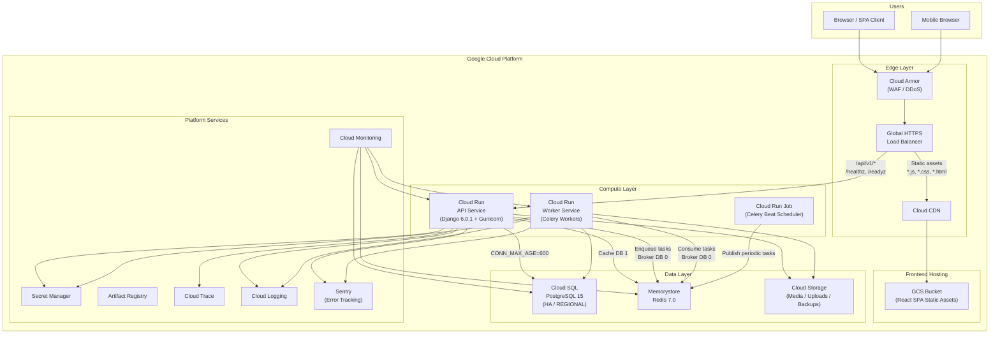

### 1.2 Technology Stack Summary

| Layer | Technology | Version |
|-------|-----------|---------|
| **Frontend** | React, TypeScript, Vite | 18.3, 5.6, 5.4 |
| **UI Framework** | TailwindCSS, Headless UI | 3.4, 2.1 |
| **State Management** | Zustand, React Query | 4.4, 5.0 |
| **Routing** | React Router DOM | 6.21 |
| **Forms** | React Hook Form + Zod | 7.49, 3.22 |
| **Charts** | Recharts | 2.10 |
| **Backend** | Django, DRF | 6.0.1, 3.16.1 |
| **Auth** | SimpleJWT (HS256) + 2FA | - |
| **Auth Backends** | Local, LDAP, Azure AD | - |
| **Database** | PostgreSQL | 15 |
| **Cache / Broker** | Redis (Memorystore) | 7.0 |
| **Task Queue** | Celery + Beat | - |
| **API Docs** | drf-spectacular (OpenAPI 3) | - |
| **Container Runtime** | Cloud Run (GCP) | - |
| **IaC** | Terraform (12 modules) | - |
| **CI/CD** | GitHub Actions (5 workflows) | - |
| **Monitoring** | Cloud Monitoring, Sentry, Cloud Trace | - |

---

## 2. Application Architecture

### 2.1 Django Module Map

The 21 Django apps are organized into four functional domains. Module access is enforced at runtime by `ModuleAccessMiddleware`, which auto-discovers the module name from the URL path (`/api/v1/<module>/...`) and checks the tenant's license. Ungated modules (core, accounts, organization, assistant, policies) are always accessible.

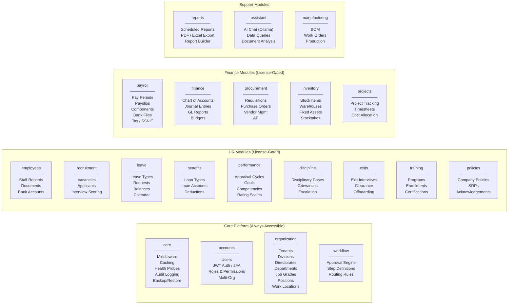

### 2.2 Middleware Pipeline

Requests pass through middleware in the order defined in `config/settings/base.py`. The tenant and module-access layers sit between Django's authentication middleware and the view layer.

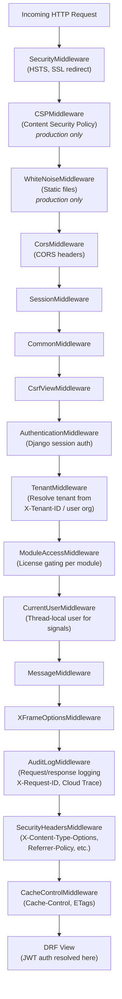

### 2.3 Authentication Architecture

The system supports three authentication backends configured in `AUTHENTICATION_BACKENDS`:

| Priority | Backend | Use Case |
|----------|---------|----------|
| 1 | `LocalAuthBackend` | Username/password with HRMS user model |
| 2 | `LDAPAuthBackend` | Corporate directory integration |
| 3 | `AzureADBackend` | Microsoft 365 / Entra ID SSO |
| 4 | `ModelBackend` | Django admin fallback |

JWT tokens use HS256 signing with configurable lifetimes (default: 30-minute access, 1-day refresh). Refresh token rotation is enabled with automatic blacklisting of old tokens.

---

## 3. Data Flow Diagrams

### 3.1 Authentication Flow

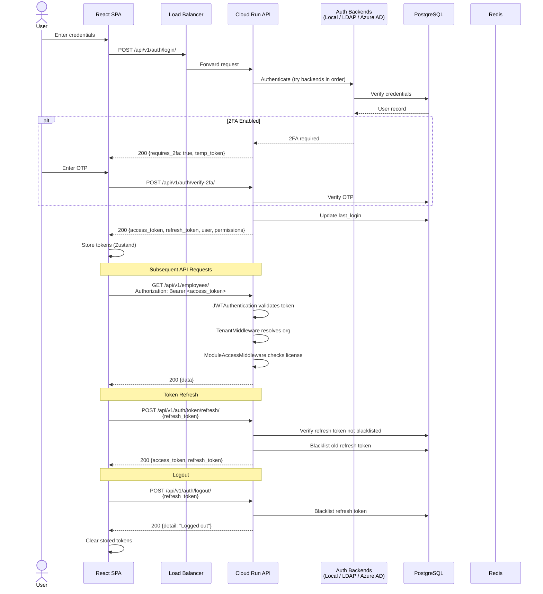

### 3.2 Payroll Processing Flow

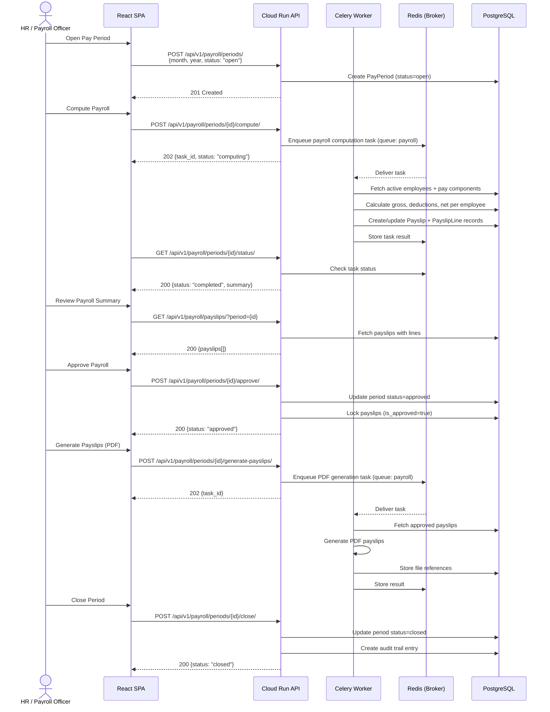

### 3.3 Report Generation Flow

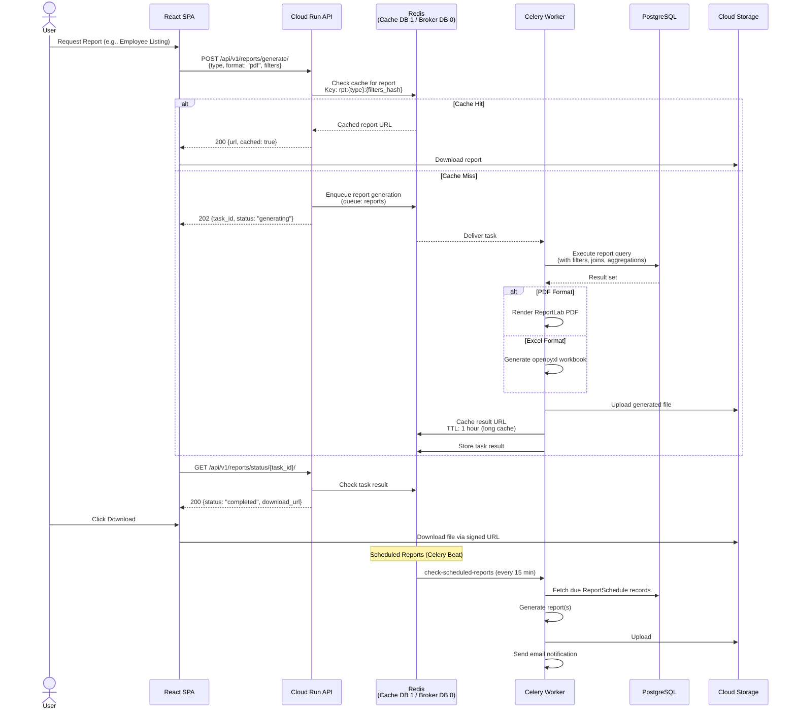

### 3.4 Multi-Tenant Request Flow

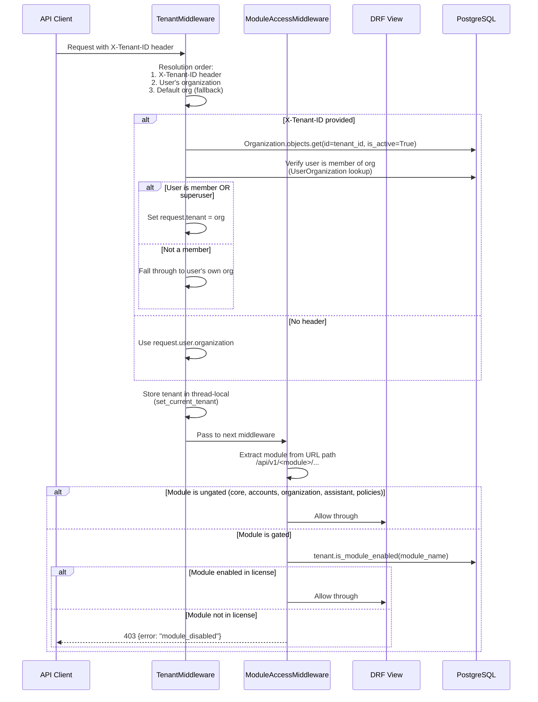

---

## 4. Service Dependency Map

### 4.1 Runtime Dependencies

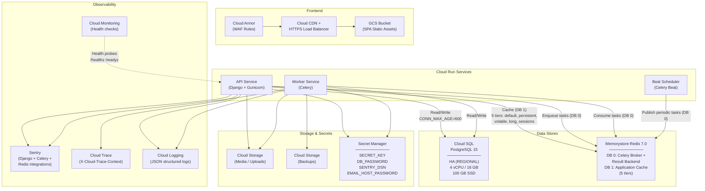

### 4.2 Celery Task Queues and Periodic Tasks

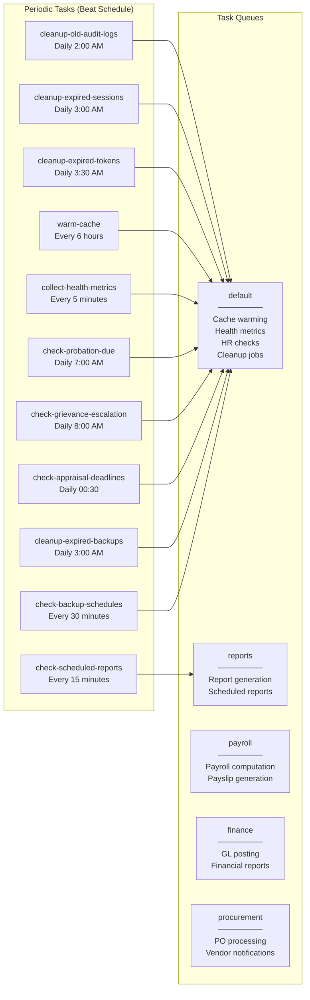

### 4.3 Cache Tiers

| Tier | Alias | TTL | Key Prefix | Purpose |
|------|-------|-----|------------|---------|
| **Default** | `default` | 5 min | `hrms` | General API response caching |
| **Persistent** | `persistent` | 24 hrs | `hrms_persist` | Lookup data (grades, positions, banks, leave types) |
| **Volatile** | `volatile` | 1 min | `hrms_volatile` | Dashboard stats, employee counts |
| **Long** | `long` | 1 hr | `hrms_long` | Generated reports, computed aggregations |
| **Sessions** | `sessions` | 24 hrs | `hrms_sessions` | Django session store |

Cache invalidation is automatic via Django signals connected in `core/caching.py`. When a model instance is saved or deleted, the corresponding cache pattern is purged using Redis SCAN.

---

## 5. Infrastructure Layout

### 5.1 Network Architecture

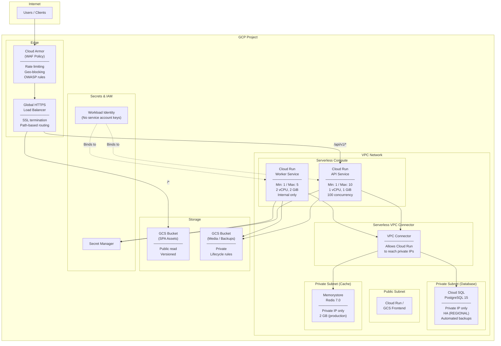

### 5.2 Terraform Module Structure

The infrastructure is defined across 12 Terraform modules, each responsible for a single concern:

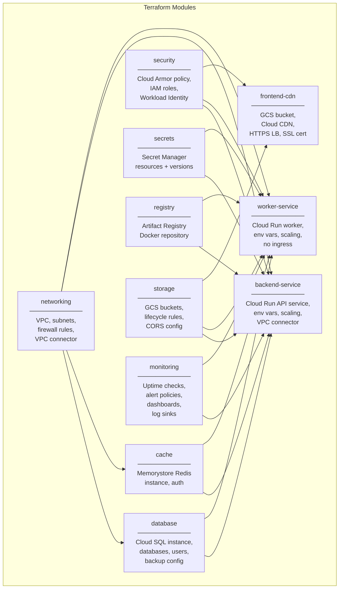

### 5.3 CI/CD Pipeline

Five GitHub Actions workflows govern the delivery pipeline:

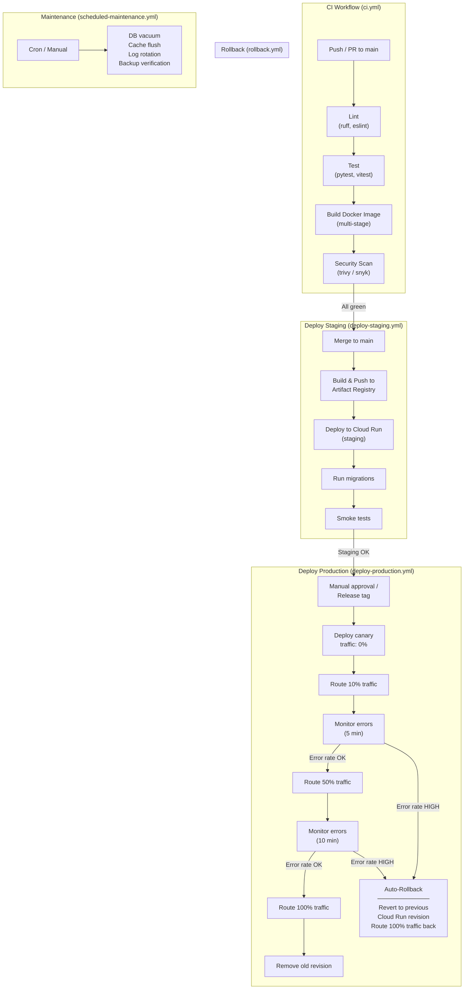

### 5.4 Canary Deployment Detail

The production deployment uses a progressive canary strategy with automatic rollback:

| Stage | Traffic Split | Duration | Rollback Trigger |
|-------|--------------|----------|-----------------|
| 1. Deploy | 0% (new revision exists) | Immediate | Build failure |
| 2. Canary | 10% to new revision | 5 minutes | Error rate > 1% |
| 3. Partial | 50% to new revision | 10 minutes | Error rate > 0.5% |
| 4. Full | 100% to new revision | Permanent | Manual trigger only |

---

## 6. Capacity Planning

### 6.1 Current Production Sizing

The system is designed to handle 1M+ records across all modules. Current resource allocation:

| Resource | Configuration | Notes |
|----------|--------------|-------|
| **Cloud SQL** | 4 vCPU, 16 GB RAM, 100 GB SSD | HA (REGIONAL), auto-resize up to 500 GB |
| **Redis** | 2 GB (Memorystore) | Shared: broker (DB 0) + cache (DB 1) |
| **API Service** | 1--10 instances, 1 vCPU, 1 GiB each | 100 concurrent requests per instance |
| **Worker Service** | 1--5 instances, 2 vCPU, 2 GiB each | Prefetch multiplier = 1, concurrency = 4 |
| **Connection Pool** | CONN_MAX_AGE = 600 | Persistent connections within Cloud Run instance lifecycle |
| **Database Indexes** | 60+ indexes | 46 on employees table alone; covering indexes for common queries |
| **Migrations** | 63 applied | Across all 21 apps |

### 6.2 Performance Characteristics

| Metric | Target | Mechanism |
|--------|--------|-----------|
| API response (cached) | < 50 ms | Redis 5-tier caching |
| API response (uncached) | < 500 ms | PostgreSQL with covering indexes |
| Payroll computation (1,000 employees) | < 60 s | Async Celery task on payroll queue |
| Report generation (PDF) | < 30 s | Async Celery task on reports queue |
| Cache hit ratio (lookups) | > 95% | 24-hour TTL on persistent cache, signal-based invalidation |
| Health check latency | < 100 ms | /healthz (liveness) and /readyz (DB + Redis check) |

### 6.3 Scaling Beyond 10M Records

When the system approaches 10M total records (particularly in payroll, audit logs, and leave transactions), the following scaling measures should be applied:

```
Phase 1: Vertical Scaling
--------------------------
- Cloud SQL: Upgrade to 8 vCPU / 32 GB RAM
- Redis: Increase to 5 GB
- API instances: Increase max to 20
- Worker instances: Increase max to 10

Phase 2: Read Scaling
--------------------------
- Add Cloud SQL read replica for reporting queries
- Route report generation tasks to read replica
- Configure Django DATABASE_ROUTERS for read/write splitting
- Add CDN caching for report downloads (signed URLs with short TTL)

Phase 3: Data Partitioning
--------------------------
- Partition payroll_payslipline by pay_period (range partitioning)
- Partition core_auditlog by created_at (monthly range)
- Partition leave_leavebalance by leave_year
- Archive records older than 7 years to cold storage (GCS)

Phase 4: Infrastructure Evolution
--------------------------
- Evaluate migration from Cloud Run to GKE for:
  - More granular resource control
  - Pod autoscaling based on queue depth
  - Dedicated node pools for worker tasks
- Consider PgBouncer for connection pooling at scale
- Add Flower for Celery monitoring dashboard
- Implement database connection pooling via AlloyDB (if PostgreSQL compatibility needed)
```

### 6.4 Disaster Recovery

| Scenario | RTO | RPO | Mechanism |
|----------|-----|-----|-----------|
| API instance failure | < 30 s | 0 | Cloud Run auto-restart + health checks |
| Database failure | < 5 min | 0 | Cloud SQL HA (REGIONAL) automatic failover |
| Redis failure | < 2 min | Volatile data loss | Memorystore auto-recovery; app falls back to DB |
| Region outage | < 1 hr | < 5 min | Cross-region Cloud SQL backup restore; DNS failover |
| Data corruption | < 30 min | < 24 hr | Automated daily backups + Celery backup schedule checks |
| Bad deployment | < 2 min | 0 | Canary rollback to previous Cloud Run revision |

---

*This document describes the NHIA HRMS architecture as of 2026-02-14. It should be updated whenever significant infrastructure or architectural changes are made.*
